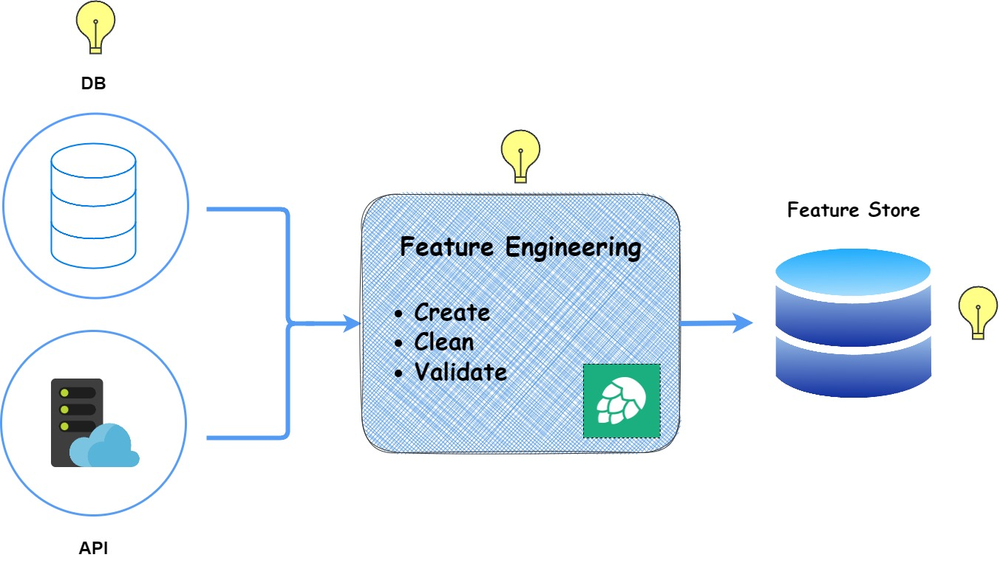

#  Feature Pipeline

[    ](../Feature_Pipeline.jpg)

### Feature Store
Feature stores serve as centralized repositories, housing frequently used features that can be readily accessed, processed, and shared across machine learning models and teams. Beyond storing and managing feature values, they possess the capability to convert raw data from sources such as cloud data warehouses, data lakes, or streaming applications into meaningful features. These features are invaluable for training new machine learning models and scoring incoming data, ultimately contributing to the success of ML-powered applications.

Some advantages:

 - Feature reuse
 - Feature consistency
 - Maintain peak model performance
 - Security and Governance
 - Collaboration between data engineers and data scientists.

:point_right: To understand Hopsworks feature store refer to this [link](https://docs.hopsworks.ai/3.2/concepts/fs/).

### Feature Pipeline
A feature pipeline is a series of steps that manages the execution of a dataflow graph, handling tasks such as validation, aggregation, dimensionality reduction, transformation, and various feature engineering steps. Its purpose is to process raw input data, creating or updating feature data efficiently.

## Creating Virtual Environment

We are using poetry to create `venv`, but you can also use python default virtual environment tool.

Firstly, to create `venv` using poetry we need `pyproject.toml` file. You can also create your own `.toml` file using `poetry init` command.

After creation of `pyproject.toml` file, now following these commands we will be able to create `venv`.
```bash
poetry install
# to activate venv
poetry shell
```
:point_right: FYI, if you want to create venv just in your project directory then run this command before installing dependencies.

```bash
poetry config virtualenvs.in-project true
```


> Written with [StackEdit](https://stackedit.io/).