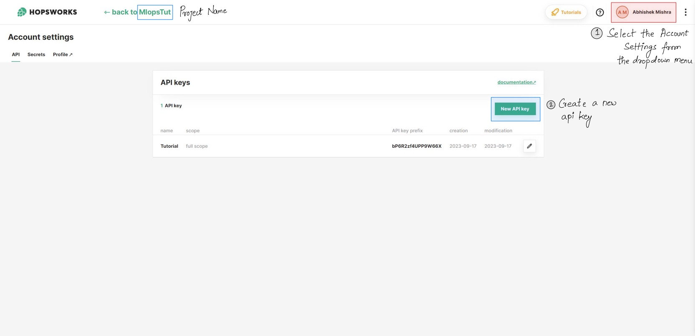

# MLOPS Tutorial
This tutorial is directly referenced from the **[FULL STACK 7-STEPS MLOPS FRAMEWORK](https://towardsdatascience.com/a-framework-for-building-a-production-ready-feature-engineering-pipeline-f0b29609b20f)** tutorial by *Paul Lusztin*. I've also added some of my own notes and comments to the tutorial. Also do not forget to checkout his medium posts I have linked below.

> Written with [StackEdit](https://stackedit.io/).

## Introduction

This tutorial is spread in 7 lessons:
|Lessons|Medium Link|
|--|--|
| Batch Serving, Feature Stores. Feature Engineering Pipelines | [Link](https://towardsdatascience.com/a-framework-for-building-a-production-ready-feature-engineering-pipeline-f0b29609b20f) |
|Training Pipelines. ML Platforms. Hyperparameter Tuning|[Link](https://medium.com/towards-data-science/a-guide-to-building-effective-training-pipelines-for-maximum-results-6fdaef594cee)|
|Batch Prediction Pipeline. Package Python Modules with Poetry|[Link](https://medium.com/towards-data-science/unlock-the-secret-to-efficient-batch-prediction-pipelines-using-python-a-feature-store-and-gcs-17a1462ca489)|
|Private PyPi Server. Orchestrate Everything with Airflow|[Link](https://medium.com/towards-data-science/unlocking-mlops-using-airflow-a-comprehensive-guide-to-ml-system-orchestration-880aa9be8cff)|
|Data Validation for Quality and Integrity using GE. Model Performance Continuous Monitoring|[Link](https://towardsdatascience.com/ensuring-trustworthy-ml-systems-with-data-validation-and-real-time-monitoring-89ab079f4360)|
|Consume and Visualize your Model’s Predictions using FastAPI and Streamlit. Dockerize Everything|[Link](https://medium.com/towards-data-science/fastapi-and-streamlit-the-python-duo-you-must-know-about-72825def1243)|
|Deploy All the ML Components to GCP. Build a CI/CD Pipeline Using Github Actions|[Link](https://medium.com/towards-data-science/seamless-ci-cd-pipelines-with-github-actions-on-gcp-your-tools-for-effective-mlops-96f676f72012)|

By the end of all the lessons we will be able to create, implement and deploy a production level Machine Learning Pipeline.
  
**What is the goal of the ML model ?**
We will try to create a robust model to predict energy consumption levels for various consumer segments in Denmark over the next 24 hrs.

## Lesson-1

### Batch Serving
As the name suggests **batch -** where given historical data we can use this data to train our ml models in batches. This training paradigm is called offline training. Predictions are computed using batch features by pinging an offline ML model and stored in blob storage or a bucket. 

|Pros| Cons  |
|--|--|
|**Efficient resource utilization**: resources are allocated for specific time periods, reducing the risk to resource contention.|**Latency**: high latency due to tasks execution in predefined intervals.|
|**Handling large volumes of data**: commonly used for data warehousing, ETL (Extract, Transform, Load) processes, and data analytics.|**Staleness**: historical static data is processed in batches for use in features. Batches might run at scheduled intervals, or when computation resources are available. However, the data/features become stale, as changes in environment is much faster in real-time.|
|**Easy to debug**: errors are isolated to specific batches making them easier to identify and fix.|**Monitoring**: may result in delays in identifying and addressing exceptions or issues withing the process. Issues might not become apparent until the entire batch is processed.|
|**Complex data preprocessing**: suitable for tasks that involves complex data transformations, cleansing and pre-processing compared to real-time serving.|**Event-driven Agility**: In scenarios where immediate responses to events are critical, batch serving falls short. It is not designed to react to events as they happen but rather to process data in batches at specific times.|
|**Scalability**: vertical and horizontal scaling can be designed based on workloads.|**Extra Overheads**: managing batch job schedules, orchestration introduces complexity and overhead.|

### What is Feature Store?
Let's breakdown its purpose and components.

A feature store is like a library for data features that are used in machine learning. These features are attributes or characteristics of the data to help ML models make predictions or decisions.

Components:

 - **Feature Collection**
 - **Catalog and metadata**: a feature store has a catalog that describes each feature. It includes the name of the feature and what it represents (e.g., customer age, product price) and how it's computed or transformed.
 - **Access and Usage**
 
 Key features and functions:
 - Feature registration
 - Data Ingestion
 - Versioning
 - Feature Serving
 - Feature Catalog
 - Data consistency
 - Data monitoring
 - Caching and Performance Optimization

Examples of feature stores used in the industry

 - GCP Vertex Feature Store
 - AWS Sagemaker Feature Store
 - Hopswork Feature Store ( we are using this for our tutorial coz its free :smile:)
 - ...

### Feature Engineering Pipeline
A sequence of data collection, cleansing, transformation, validation step following by loading into the feature store (like an ETL pipeline).

The primary objective of an ETL (Extract, Transform, Load) pipeline is to prepare raw data, resulting in a cleansed and well-structured dataset that is suitable for analysis and monitoring. When this prepared dataset undergoes additional processing steps such as encoding, scaling, feature extraction, and aggregation, it evolves into a feature engineering pipeline. In the feature engineering pipeline, the focus shifts towards creating and enhancing features tailored for machine learning tasks.

Key components:

 - Data collection
 - Data cleaning
 - Feature Extraction/Transformation/Aggregation
 - Feature selection
 - Feature scaling
 - Feature encoding
 - Validation
 
 :point_right:In this tutorial we are using Pandas as the dataset is small, but for large volumes of data we can use Spark.

